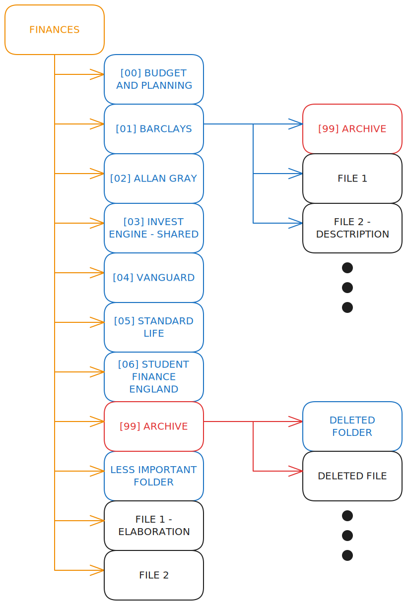

# How I Structure My Files
This is mostly future reference for myself 😊
I like to keep digitally organised (although I do go through phases every now and then of swamping easy access locations such as the desktop or downloads folder with all sorts of higgildy piggildy files). Here, I briefly touch on the few methods and rules I follow to stay organised and clutter-free, while not deleting the old stuff. 
## 📄 File Name Conventions
* Always relevant - even if obvious in the current context, a good name is easy to search for later on.
* If the name is overly technical and liable to forgetting (i.e. `erp-bel-422 - VPACH`), then include other identifiable information such as the date, or project it relates to. This makes it searchable when it's difficult to remember specificts. 
* Stay consistent with syntax. I personally don't use underscores over spaces unless I need to (such as interacting with files via the terminal). I usually elaborate using `A - B`, i.e. `Reference/Name - Short Description`.
## 📁 Folder Name Conventions

I name folders following the aforementioned rules, but with a bit of extra spice: 
* I'd like to keep common folders I use a lot at the top of the list and I'd also like to order them by how often I access them, with commonly used folders easily found at the top of the list. To do this, I prepend the folders using `[index]`. E.g. `[02] Pictures`. This folder will always be listed second in the list, after `[01] Example Folder`, and both of these folders will be easy to find right at the top of the list. 
* I also accrue old files which I'd like to clear away, but not delete. For this, I use a `[99] Archive` folder to throw the messy stuff into. 
* I'm happy to use these hierarchical folder names and archive folders wherever they're needed, no matter of which level they're at, or how specific the content is. All that matters is that things are easy to find and tidy. 
## Example

